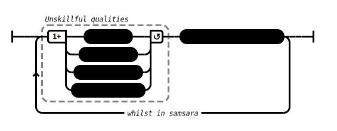

# A Single Thing

## Context
* The sutta is all about the mind
* The mind is associated with a self

## Process

Figure 1: high-level process of the mind

## Causal chains

Figure 2: Developed mind causal chain

Figure 3: Undeveloped mind causal chain

Figure 3: Skillful mind causal chain

Figure 4: Unskillful mind causal chain

## References
1. https://www.dhammatalks.org/suttas/AN/AN1_21.html