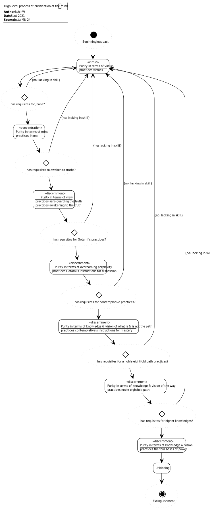

# A Pool of Water (AN 1:45–46)

## Source
1. https://www.dhammatalks.org/suttas/AN/AN1_45.html
2. https://www.dhammatalks.org/suttas/MN/MN24.html

## Context
* The sutta is about the results of a im/pure mind

## Causal chains

Figure 1: Impure mind causal chain

Figure 2: Pure mind causal chain

## Process

Figure 3: High-level process of purification of the mind

## Concepts

Figure 4: Purification of the mind
