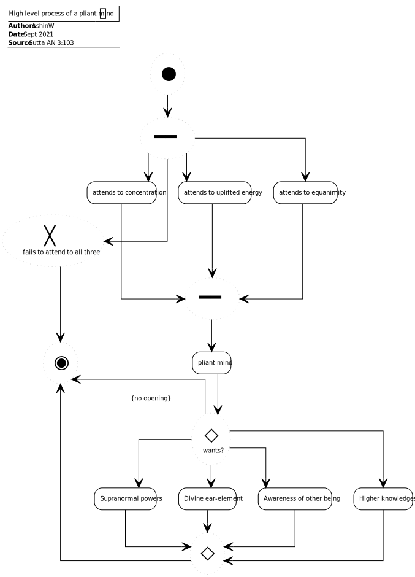

# Soft (AN 1:48)

## Source
1. https://www.dhammatalks.org/suttas/AN/AN1_48.html
2. https://www.dhammatalks.org/suttas/AN/AN3_103.html

## Context
* The sutta is about the potentials of a pliant mind

## Causal chains

Figure 1: Pliant mind causal chain

## Process

Figure 2: High-level process of a plaint mind

## Concepts

Figure 3: Pliant mind
