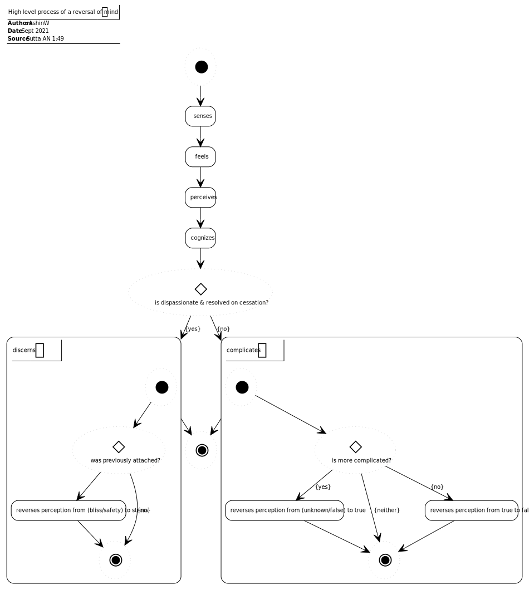

# Quick to Reverse Itself (AN 1:49)

## Source
1. https://www.dhammatalks.org/suttas/AN/AN1_49.html

## Context
* The sutta is about perceptions and views and a reversal of mind

## Causal chains

Figure 1: Reversal of mind causal chain

## Process

Figure 2: High level process of a reversal of mind

## Concepts

Figure 3: Reversal of mind
