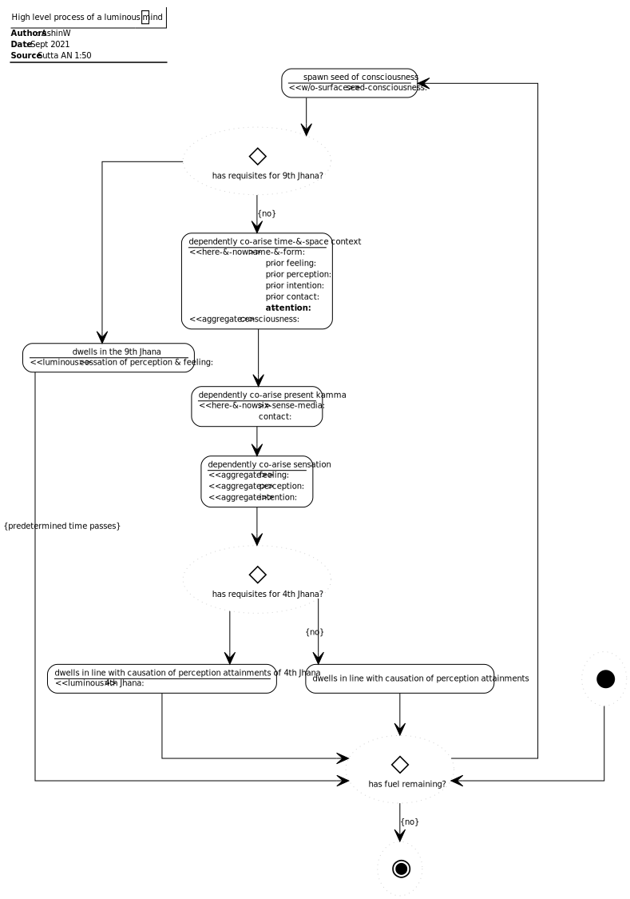

# Luminous (AN 1:50–53)

## Source
1. https://www.dhammatalks.org/suttas/AN/AN1_50.html

## Context
* Defilements of the mind are threefold:
  1. Passion
  2. Aversion
  3. Delusion
* Delusion is in reference to the dualities of a supposition to which:
  - one holds as true, but the noble ones declare as false
  - one holds as false, but the noble ones declare as true
* A developed mind subdues and gains freedom from greed, aversion & delusion
* Passion, aversion & delusion can be subdued through a combination of:
  1. Perceptions
  2. Sublime attitudes
  3. Jhana
* Consciousness without surface is the foremost luminous mind state prior to being impinged by name & form (and/or time/space)
* The perceptions established in the 4th Jhana reveals the luminosity of the luminous mind whilst bound by time/space
* One who dwells in the cessation of perception & feeling (ie. 9th Jhana), dwells with just luminous mind unbound by time/space and sustained by vitality, heat and consciousness
* The sutta is about factors that either support or obstruct a luminous mind

## Causal chains

Figure 1: Lumious mind causal chain

Figure 2: Non-lumious mind causal chain

## Process

Figure 3: High level process of a luminous mind

## Concepts

Figure 4: Luminous of mind
