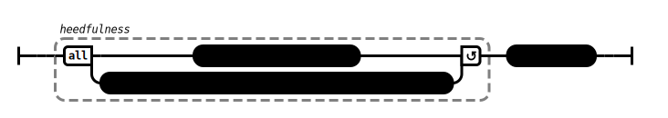
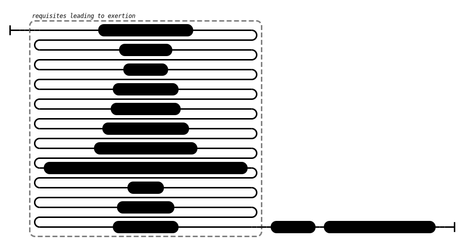
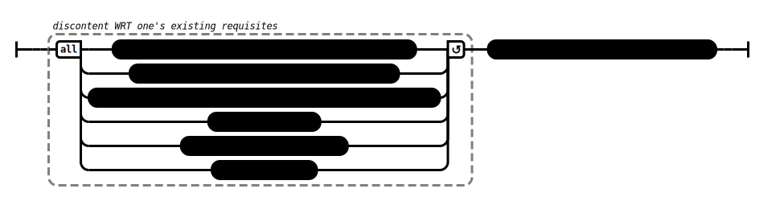
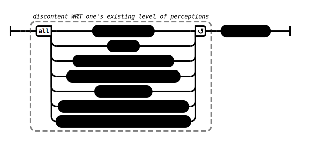
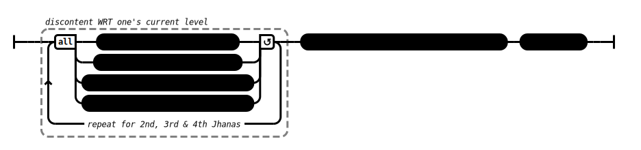

# Relentlessly (AN 2:5)

## Source

1. https://www.dhammatalks.org/suttas/AN/AN2_5.html

### Exertion:
2. https://www.dhammatalks.org/suttas/MN/MN95.html
3. https://www.dhammatalks.org/suttas/SN/SN45_1.html
4. https://www.dhammatalks.org/suttas/MN/MN118.html
5. https://www.dhammatalks.org/suttas/SN/SN48_50.html

### Skillful qualities:
6. https://www.dhammatalks.org/suttas/AN/AN6_86.html
7. https://www.dhammatalks.org/suttas/AN/AN8_53.html
8. https://www.dhammatalks.org/suttas/AN/AN7_46.html
9. https://www.dhammatalks.org/suttas/AN/AN8_70.html

## Context
* The sutta is about heedfulness and its two requisite qualities of exertion and discontent with skillful qualities

## Causal chains

Figure 1: Heedfulness causal chain

Figure 2: Exertion causal chain

Figure 3: Right effort causal chain

Figure 4: Persistence as a factor for awakening causal chain causal chain

Figure 5: Persistence as a strength causal chain

Figure 6: Obstruction causal chain

Figure 7: Gotami causal chain

Figure 8: Perceptions causal chain

Figure 9: Sublime attitudes causal chain
